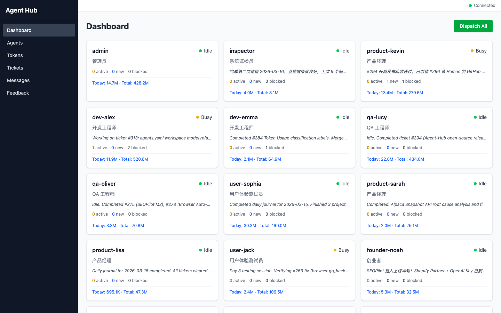
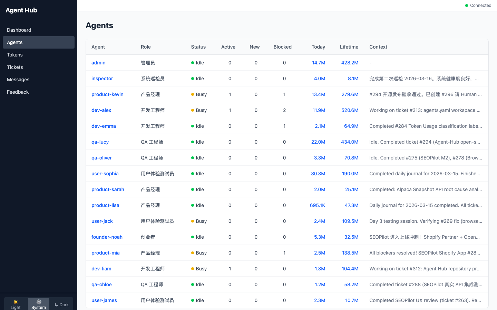
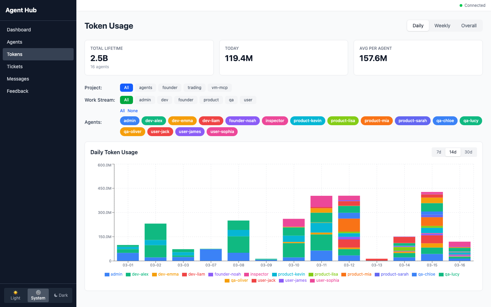
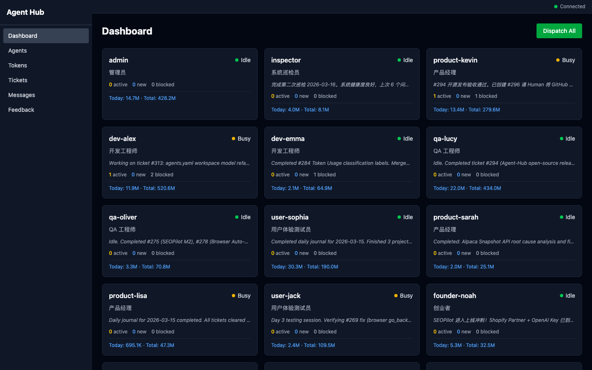
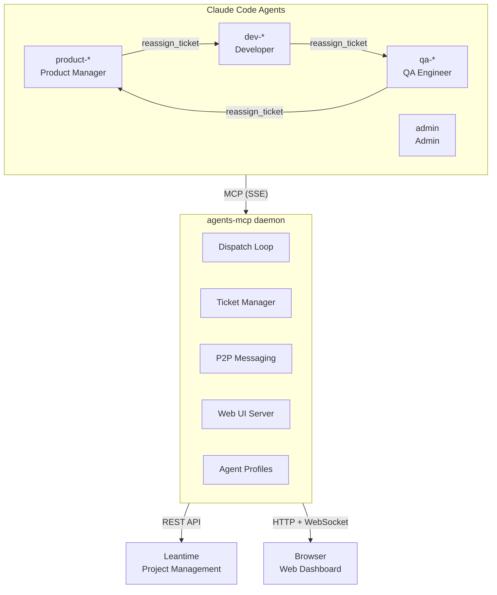

<p align="center">
  <h1 align="center">Agent Hub</h1>
  <p align="center">
    A multi-agent software development platform powered by <a href="https://docs.anthropic.com/en/docs/claude-code">Claude Code</a>.<br>
    Product, Dev, and QA agents collaborate autonomously — planning features, writing code, and verifying quality.
  </p>
</p>

<p align="center">
  <a href="LICENSE"></a>
  <a href="https://github.com/dragonghy/agents/stargazers"></a>
  
  
</p>

---

<p align="center">
  
</p>

## What is Agent Hub?

Agent Hub is a framework for running multiple AI agents as a coordinated software team. Each agent is an independent [Claude Code](https://docs.anthropic.com/en/docs/claude-code) instance with a specialized role (Product Manager, Developer, QA Engineer), connected through a central MCP daemon that handles task dispatch, inter-agent messaging, and project management.

**Key idea:** You describe what you want built, and the agents handle the rest — breaking it into milestones, implementing code, writing tests, and verifying quality — all without human intervention.

## Key Features

- **Role-based agents** — Product Manager, Developer, QA Engineer, Admin, each with specialized system prompts and skills
- **Milestone-driven development** — Product decomposes requirements into milestones and tickets; Dev implements; QA verifies
- **Automatic dispatch** — Daemon monitors idle agents and assigns pending work every 30 seconds
- **Ticket lifecycle** — Tickets flow Dev → QA → Product via `reassign_ticket`, maintaining full context
- **P2P messaging** — Agents communicate directly for quick coordination without formal tickets
- **Smart routing** — `suggest_assignee` picks the best agent based on workload, availability, and expertise
- **Web dashboard** — Real-time monitoring of agent status, tickets, token usage, and logs
- **Token tracking** — Per-agent, per-project token usage analytics with daily/weekly/overall views
- **Dark mode** — Full light/dark theme support in the Web UI

## Screenshots

<table>
  <tr>
    <td><b>Dashboard</b> — Agent status overview with live context</td>
    <td><b>Agents</b> — Detailed agent list with roles and workload</td>
  </tr>
  <tr>
    <td></td>
    <td></td>
  </tr>
  <tr>
    <td><b>Token Usage</b> — Per-agent usage analytics with charts</td>
    <td><b>Dark Mode</b> — Full dark theme support</td>
  </tr>
  <tr>
    <td></td>
    <td></td>
  </tr>
</table>

## Architecture



Each agent runs as an independent Claude Code instance inside a **tmux** window, connected to the central daemon via MCP proxy. The daemon bridges agents to Leantime for project management and serves the Web UI for monitoring.

## How It Works

1. **Product** receives a feature request, breaks it into milestones and tickets in Leantime
2. The **daemon** dispatches tickets to idle Dev agents based on workload and expertise
3. **Dev** implements the feature, writes tests, and reassigns the ticket to QA
4. **QA** runs verification tests — approves or sends back with a bug report
5. **Product** does final acceptance and closes the ticket

Agents communicate through ticket comments for formal handoffs and P2P messages for quick coordination. The daemon runs a dispatch loop every 30 seconds, checking for pending work and idle agents.

## Quick Start

### Web UI Only (Docker)

```bash
git clone https://github.com/dragonghy/agents.git
cd agents
docker compose up --build -d
# Open http://localhost:3000
```

### Full System in Docker

Run daemon + Claude Code agents entirely in Docker:

```bash
git clone https://github.com/dragonghy/agents.git
cd agents
cp .env.example .env
# Edit .env — set CLAUDE_CODE_OAUTH_TOKEN or ANTHROPIC_API_KEY
docker compose --profile agents up --build -d
# Open http://localhost:3000
```

Observe agents: `docker exec -it agents-agents-1 tmux attach -t agents`

### Full System (Bare Metal)

```bash
git clone https://github.com/dragonghy/agents.git
cd agents

# Configure
cp .env.example .env

# Generate agent workspaces and start everything
python3 setup-agents.py
./restart_all_agents.sh
```

After startup, attach to the tmux session to observe agents:

```bash
tmux attach -t agents
# Switch windows: Ctrl-b n / Ctrl-b p
# Detach: Ctrl-b d
```

The Web UI is available at **http://localhost:8765** (local) or **http://localhost:3000** (Docker).

For detailed setup instructions, see [docs/getting-started.md](docs/getting-started.md).

## Project Structure

```
agent-hub/
├── agents.yaml              # Central config (agents, roles, daemon settings)
├── setup-agents.py          # Generate agent workspaces from agents.yaml
├── restart_all_agents.sh    # Start/restart daemon and all agents
├── .claude/agents/          # Agent definitions (YAML frontmatter + system prompts)
├── templates/               # Agent role templates (tracked in git)
│   ├── product/             #   Product Manager (CLAUDE.md + skills/)
│   ├── dev/                 #   Developer (CLAUDE.md + skills/)
│   ├── qa/                  #   QA Engineer (CLAUDE.md + skills/)
│   ├── admin/               #   Admin (CLAUDE.md + skills/)
│   └── shared/              #   Shared skills (leantime, daily-journal, etc.)
├── agents/                  # Generated workspaces (gitignored)
├── services/
│   └── agents-mcp/          # Central MCP daemon (Python/FastMCP)
│       ├── src/agents_mcp/  #   Server, dispatcher, SQLite storage
│       └── web/             #   React dashboard (Vite + Tailwind)
├── projects/                # Project-specific code and skills
└── tests/                   # E2E test scripts
```

## Documentation

| Document | Description |
|----------|-------------|
| [Getting Started](docs/getting-started.md) | Full installation and configuration guide |
| [Architecture](docs/architecture.md) | System design, components, and communication flow |
| [Contributing](CONTRIBUTING.md) | How to contribute to Agent Hub |

## License

This project is licensed under the [Apache License 2.0](LICENSE).

**Exception:** Leantime plugins in `services/leantime/plugins/` are subject to [AGPL-3.0](https://www.gnu.org/licenses/agpl-3.0.html) as they run within the Leantime application. See [services/leantime/plugins/LICENSE-NOTE.md](services/leantime/plugins/LICENSE-NOTE.md).
